# Hotel Management System Database 
The database is created for a resort hotel called **Relaxy Resort**. Relaxy Resort has resort hotels in five countries. </br>

The **RESORT_HOTEL** database stores business information in 10 entities: 
* RESORTS
* EMPLOYEES
* SERVICES
* CUSTOMERS
* RESERVATIONS
* BILLS
* RESTAURANTS
* ROOMS
* STRUCTURES
* ACTIVITIES

Each hotel has many restaurants, rooms, and structures for leisure activities. </br>
The employees may access **CUSTOMER** entity for information about customers, and *CUS_ID* is linked to **RESERVATIONS**, and **BILLS** entities. </br>
The Human Resources Department may access **EMPLOYEES** entity for information about employees, and *EMP_ID* is linked to **SERVICES** entity, which shows the responsibilities of the employees. </br>
The management team may use all the stored data to support decision-making and future-planning. </br>

In the ERD model, there is a many-to-many relationship between **ROOMS** and **RESERVATIONS** connected by an associative entity, **RESROOM**. This relationship indicates one room can be reserved by multiple customers for different dates, and one reservation can book several rooms.

##  Entity-Relationship Diagram (ERD)
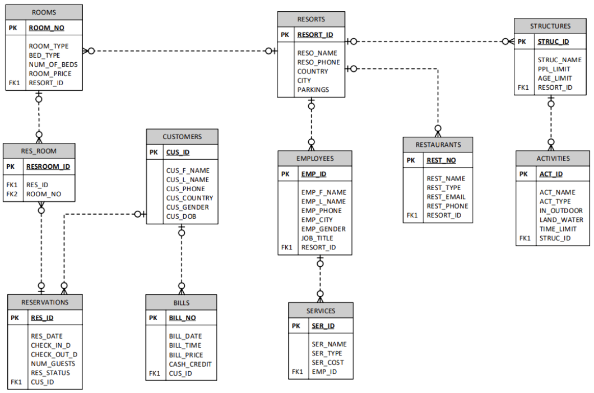

## 5 User Stories 
1. As a customer, I want to find out different room types, so that I can book a room based on my preference.
2. As a manager, I want to know the services that each employee does, so that I can assign the appropriate workload to each employee.
3. As a concierge, I want to be able to view customer bills, so that I can help customers with their payments.
4. As a customer, I want to know the activities that the resort hotel has, so that I can participate in the activities.
5. As a concierge, I want to be able to see room reservations, so that I can assist customers with check-in and check-out.

## Tables 
### Table **RESORTS** </br>
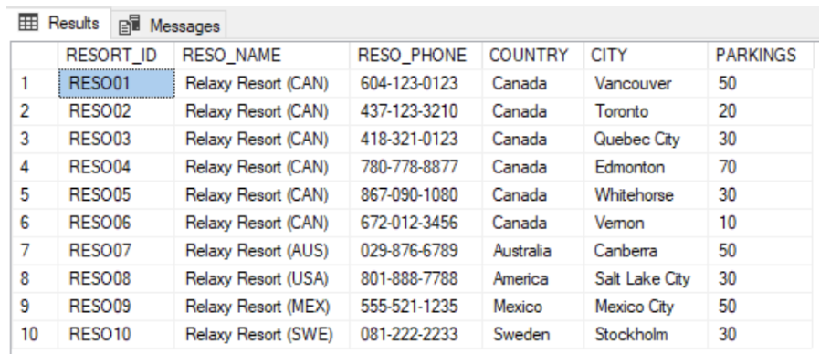

### Table **EMPLOYEES** </br>
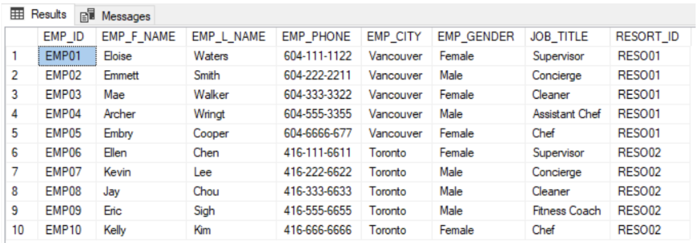

### Table **SERVICES** </br>
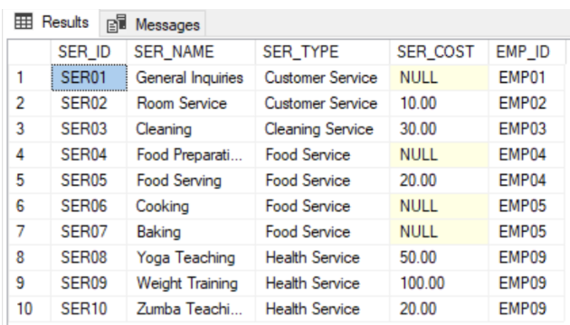

### Table **ROOMS** </br>
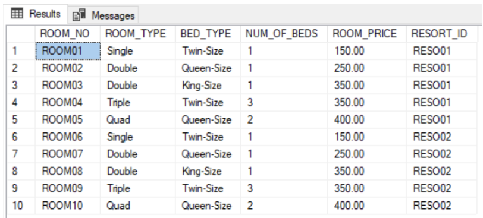

### Table **RESERVATIONS** </br>
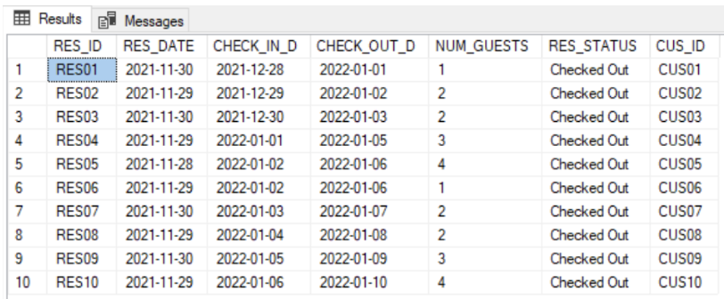

### Table **RES_ROOM** </br>
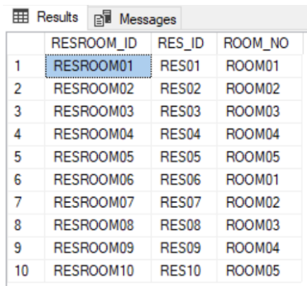

### Table **CUSTOMERS** </br>
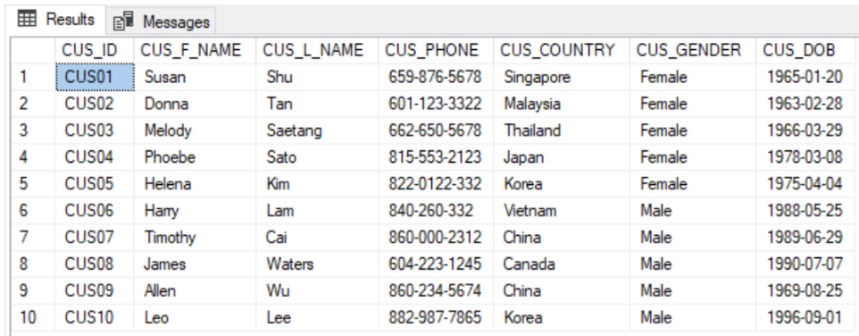

### Table **BILLS** </br>
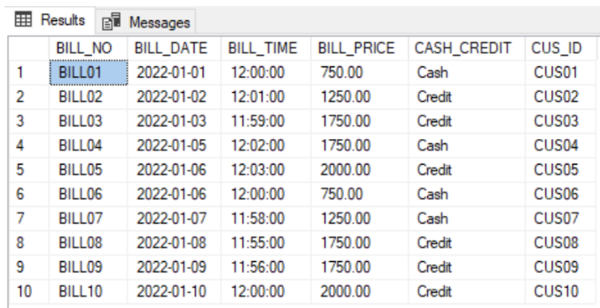

## SQL Queries 
### Inner Join 
``` SQL 
select RESERVATIONS.RES_ID, ROOMS.ROOM_NO, ROOMS.ROOM_TYPE,
    [Check_In_Date] = RESERVATIONS.CHECK_IN_D,
    [Check_Out_Date] = RESERVATIONS.CHECK_OUT_D
from ROOMS
inner join RES_ROOM on ROOMS.ROOM_NO = RES_ROOM.ROOM_NO
inner join RESERVATIONS on RES_ROOM.RES_ID = RESERVATIONS.RES_ID;
```
</br>
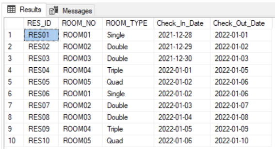

### Outer Join
``` SQL
select EMPLOYEES.EMP_ID,
    [EMP_NAME] = EMPLOYEES.EMP_L_NAME + ', ' + EMPLOYEES.EMP_F_NAME, EMPLOYEES.JOB_TITLE, SERVICES.SER_NAME, SERVICES.SER_COST
from EMPLOYEES
left outer join SERVICES on EMPLOYEES.EMP_ID = SERVICES.EMP_ID
where EMPLOYEES.EMP_ID in ('EMP04', 'EMP05', 'EMP09')
```
</br>
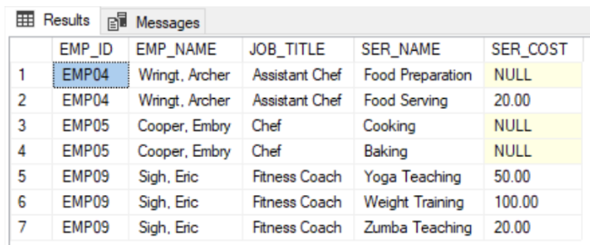

### Subquery
``` SQL
select RESERVATIONS.RES_ID, RESERVATIONS.RES_DATE, RESERVATIONS.NUM_GUESTS,
    [CHECK_IN_DATE] = RESERVATIONS.CHECK_IN_D
from RESERVATIONS
where CUS_ID =
    (select CUS_ID
    from CUSTOMERS
    where CUSTOMERS.CUS_ID = 'CUS09'
    AND CUSTOMERS.CUS_F_NAME = 'Allen')
```
</br>
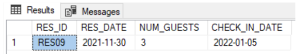

### Aggregate Function 
``` SQL
select [MIN_ROOM_PRICE] = min(ROOM_PRICE),
    [MAX_ROOM_PRICE] = max(ROOM_PRICE),
    [AVG_ROOM_PRICE] = avg(ROOM_PRICE)
from ROOMS;
```
</br>
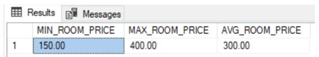

### Over Clause 
``` SQL
select BILL_NO, CUS_ID, BILL_PRICE,
    [AVERAGE_BILLS] = cast(avg(BILL_PRICE) over (order by BILL_NO) as decimal (10, 2)),
    [BILLS_SUB_TOTAL] = sum(BILL_PRICE) over (partition by BILL_NO),
    [BILLS_RUNNING_TOTAL] = sum(BILL_PRICE) over (order by BILL_NO)
from BILLS
order by BILL_NO;
```
</br>
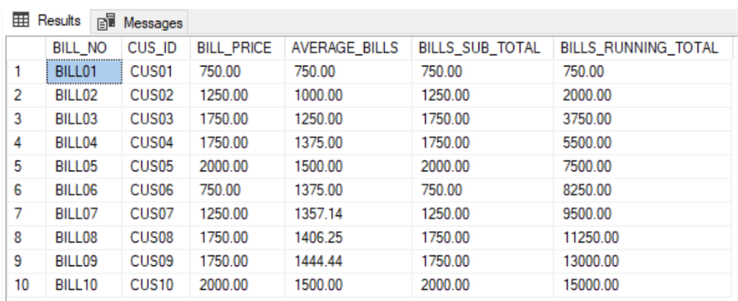

### Concierge View
``` SQL
create view CONCIERGE_VIEW
as
    select CUSTOMERS.CUS_ID,
    [CUS_NAME] = concat(CUSTOMERS.CUS_L_NAME, ', ', CUSTOMERS.CUS_F_NAME),
    CUSTOMERS.CUS_PHONE,
    ROOMS.ROOM_NO, ROOMS.ROOM_TYPE, RESERVATIONS.NUM_GUESTS,
    RESERVATIONS.CHECK_IN_D, RESERVATIONS.CHECK_OUT_D,
    [PAYMENT_DATE_TIME] = concat(BILLS.BILL_DATE, BILLS.BILL_TIME),
    BILLS.BILL_PRICE, BILLS.CASH_CREDIT, RESERVATIONS.RES_STATUS
from CUSTOMERS
inner join BILLS on CUSTOMERS.CUS_ID = BILLS.CUS_ID
inner join RESERVATIONS on CUSTOMERS.CUS_ID = RESERVATIONS.CUS_ID
inner join RES_ROOM on RESERVATIONS.RES_ID = RES_ROOM.RES_ID
inner join ROOMS on ROOMS.ROOM_NO = RES_ROOM.ROOM_NO;

select * from CONCIERGE_VIEW; 
```
</br>
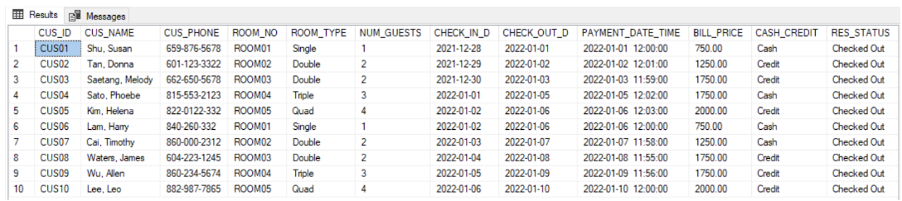